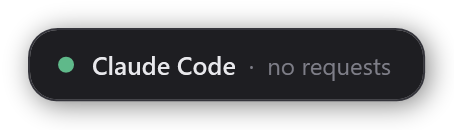
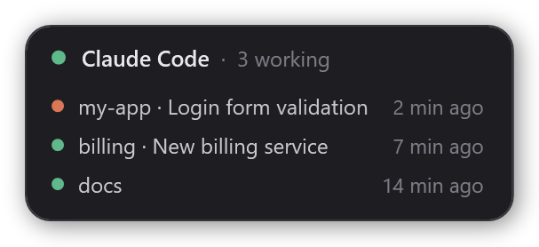
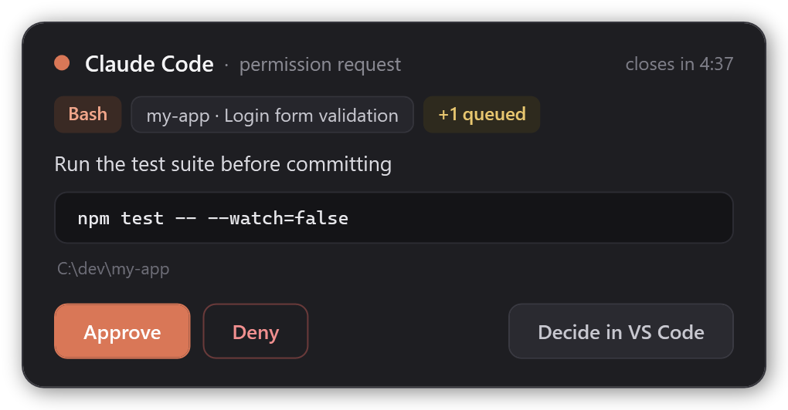
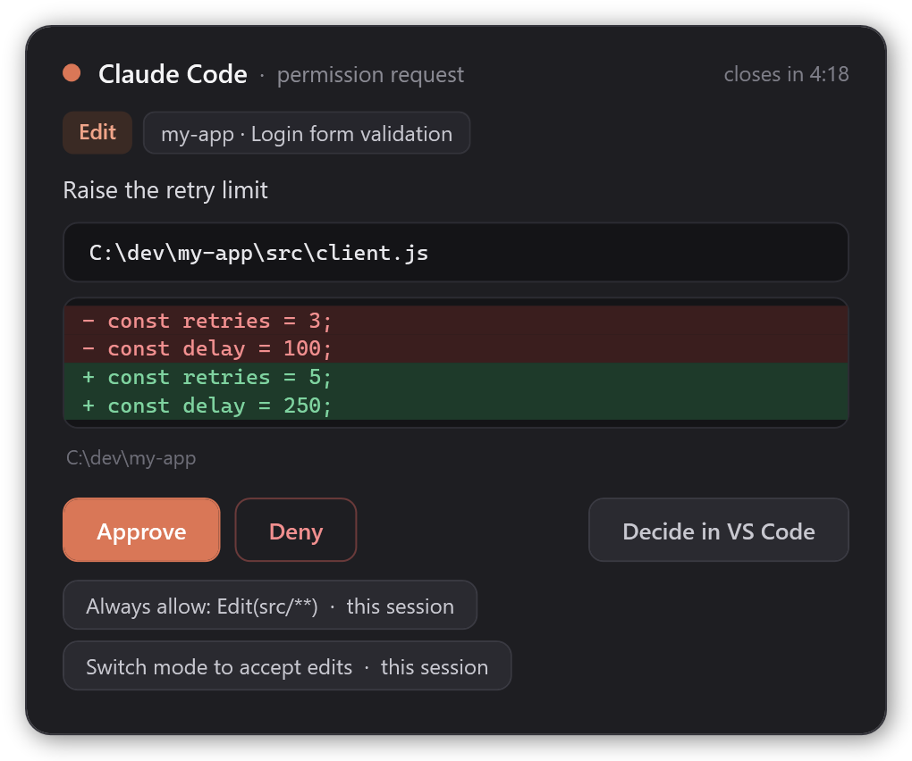
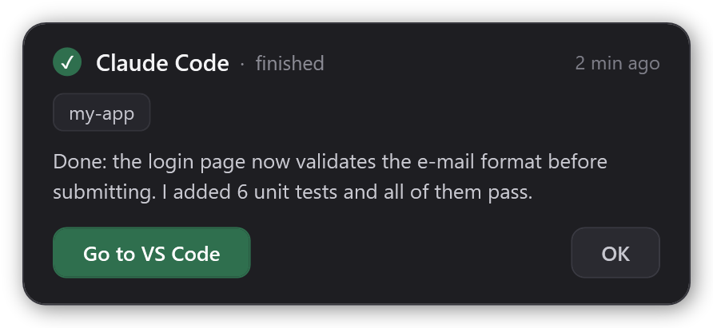
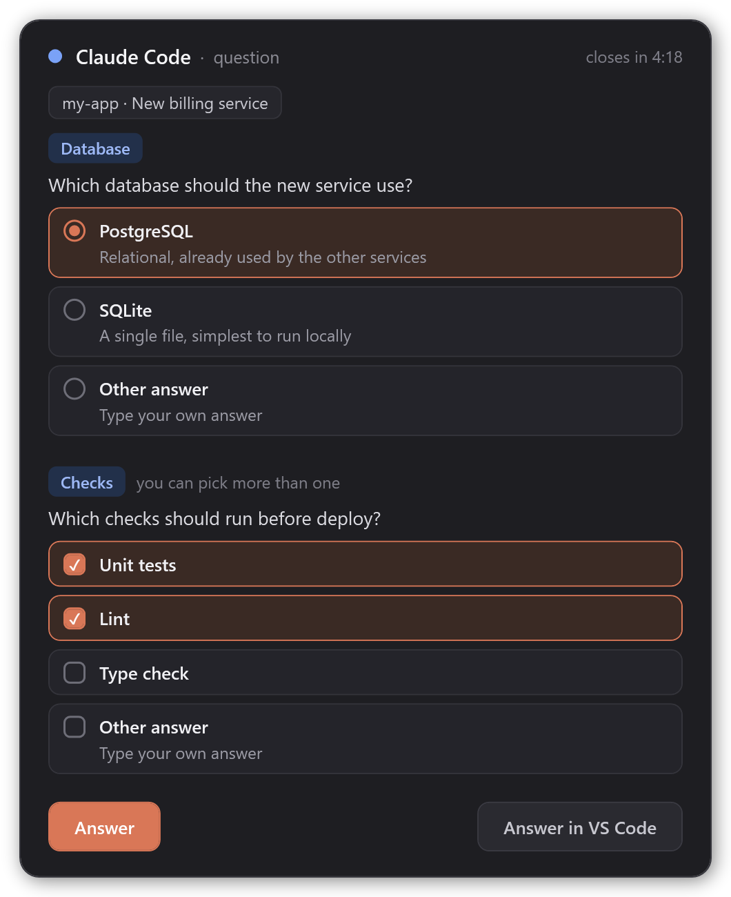

# Claude Code Widget

**English** · [Português](README.pt-BR.md)

An always-on-top desktop widget for [Claude Code](https://code.claude.com) on Windows. Keep working in other windows. When Claude needs you, a small card shows up in the corner of the screen. It never steals focus.

- **Permission requests**: see the tool, the command or file and the project, then click **Approve**, **Deny** or **Decide in VS Code**.
- **Claude's questions** (the multiple-choice ones): pick one or more options, or type your own answer.
- **"Finished" notices**: when Claude finishes a reply, the widget shows the project and the start of the reply, plus a button that takes you back to that session's window: VS Code or the terminal.

When there is nothing to show, it shrinks to a small pill that you can drag anywhere:





<table>
  <tr>
    <td valign="top">
      <br>
      <br>
      
    </td>
    <td valign="top">
      
    </td>
  </tr>
</table>

## Requirements

- Windows 10 or 11. The widget uses Windows PowerShell 5.1 and WPF, both built into Windows. It does not run on macOS or Linux.
- Claude Code, either the VS Code extension or the CLI in a terminal (Windows Terminal, PowerShell, cmd). Tested with v2.1.286. Answering questions from the widget needs v2.1.85 or later.
- VS Code is optional. Everything works with the CLI in a terminal too.

## Install

In a terminal:

```powershell
claude plugin marketplace add OPaiva-1721/claude-code-widget
claude plugin install opaiva-code-widget@claude-code-widget
```

You can also run the same commands inside Claude Code: `/plugin marketplace add OPaiva-1721/claude-code-widget`, then `/plugin install opaiva-code-widget@claude-code-widget`.

Then start a new Claude Code session, or run `/reload-plugins`. The widget opens on its own with the first session.

### Update

Coming from version 1.1.1 or earlier? Follow [Renamed in 2.0.0](#renamed-in-200) instead.

```powershell
claude plugin marketplace update claude-code-widget
claude plugin update opaiva-code-widget@claude-code-widget
```

Then start a new Claude Code session. The widget restarts with the new version on its own. See the [changelog](CHANGELOG.md) for what changed.

### Renamed in 2.0.0

Up to version 1.1.1 the plugin was called `claude-code-widget`. Claude Code now reserves plugin names that start with `claude-` for Anthropic's own plugins, so from 2.0.0 on it is `opaiva-code-widget`. The marketplace keeps its name and tells Claude Code about the new one: once the marketplace is updated, the old plugin no longer loads, and Claude Code moves your settings to the new name. Switch once by hand so the new plugin is installed and the old widget is gone:

1. **Uninstall the old plugin first.** With both installed, every request shows up in two widgets. If it says the plugin is not installed, Claude Code already moved it: just continue.

   ```powershell
   claude plugin uninstall claude-code-widget@claude-code-widget
   ```

2. Run `/reload-plugins` in every Claude Code session that is still open, or close them. Open sessions keep the old hooks and would open the old widget again. Then close the old widget: **right-click → Close widget**.
3. Install the new one:

   ```powershell
   claude plugin marketplace update claude-code-widget
   claude plugin install opaiva-code-widget@claude-code-widget
   ```

4. Start a new Claude Code session, or run `/reload-plugins`.

The widget starts in the default corner again, because the new name comes with a new data folder.

## How to use it

| What you see | What to do |
| --- | --- |
| Orange pulsing dot, **permission request** | **Approve** runs the action. **Deny** blocks it and tells Claude you denied it. **Decide in VS Code** shows the normal prompt in VS Code. For an **Edit** or **Write** the card shows the diff. **Always allow...** approves and saves the rule shown on the button (this session, this project or all projects); it only offers rules Claude Code itself suggested. |
| Blue pulsing dot, **question** | Pick an option (or several, when the question allows it), then **Answer**. **Other answer** lets you type; Enter also sends it. **Answer in VS Code** hands the question back to VS Code. |
| Green check, **finished** | **Go to VS Code** or **Go to terminal** brings that session's window to the front. **OK** dismisses the notice. |
| Idle pill, **N working** | Click it to list the working sessions (project, title, time). Click again to close the list. |

- **Drag** the widget anywhere. It remembers the position.
- **Double-click** the widget (outside its buttons) to bring back the session's window: on a "finished" notice, that session; otherwise, the session you typed in last.
- **Right-click → Close widget** closes it. Pending requests go back to VS Code. It opens again with the next session or request.
- **Tray icon.** Left-click toggles **do not disturb**; right-click for the menu. In the mode, requests and questions go straight to VS Code, the widget is hidden and "finished" notices wait until you turn it off. It stays on until you turn it off, even after a restart. Windows may hide new tray icons: drag it onto the taskbar once.
- With several requests or sessions, a chip shows how many are waiting (`+1 queued`), and they come one at a time.
- The project chip also shows the session's title (the name from `/rename`, or Claude Code's automatic one). When several sessions were working and the last one finishes, its notice plays a different sound.

## Behavior worth knowing

- **It never takes focus.** You keep typing wherever you were, even while you click its buttons. The only exception is **Other answer**: the widget takes focus so you can type, then gives it back.
- **5-minute limit.** If nobody answers, the card closes and the request goes to VS Code as usual.
- **Away from the computer.** With no mouse or keyboard input for 2 minutes, requests and questions skip the widget and go straight to VS Code. This also applies to a card already on screen. If you use [Remote Control](https://code.claude.com/docs/en/remote-control), that is how they reach your phone or browser without delay.
- **Monitor changes.** If the widget's monitor goes away (say, you undock the laptop), the widget moves to the main screen's bottom-right corner within a couple of seconds. When that monitor is back, it returns to where you put it.
- **No "finished" notice while you watch.** When you send a message, the widget remembers the window you typed in, VS Code or a terminal. If that window is in front when Claude finishes, no notice is shown. In Windows Terminal this works per window, not per tab. The notice also disappears when you send a new message in that session, and after 12 hours.
- **Plan approval stays in VS Code.** Approving a plan (`ExitPlanMode`) is never routed to the widget.
- **What it can't do:** send new prompts. Claude Code has no supported way to inject messages into a running VS Code session. For that, use Remote Control.

## Settings

Set these environment variables in the `env` block of `~/.claude/settings.json`:

| Variable | Default | What it does |
| --- | --- | --- |
| `CLAUDE_WIDGET_LANG` | Windows display language | `pt` or `en`. Any other value falls back to English. |
| `CLAUDE_WIDGET_AWAY_SECS` | `120` | Seconds without mouse or keyboard input before requests skip the widget. |
| `CLAUDE_WIDGET_HOTKEYS` | off | `1` turns on the global hotkeys. While on, those key combinations stop working in other programs, and Approve/Deny act on the permission card on screen without you looking at it. |
| `CLAUDE_WIDGET_KEY_APPROVE` | `Ctrl+Alt+Y` | Hotkey that approves the permission card on screen. |
| `CLAUDE_WIDGET_KEY_DENY` | `Ctrl+Alt+N` | Hotkey that denies it. |
| `CLAUDE_WIDGET_KEY_DND` | `Ctrl+Alt+D` | Hotkey that turns "do not disturb" on and off. |

```json
{
  "env": {
    "CLAUDE_WIDGET_LANG": "en"
  }
}
```

## How it works

```
Claude Code ──hook──▶ hook.ps1 ──queue\req-<id>.json──▶ widget.ps1 (WPF, always on top)
            ◀─JSON──           ◀──queue\res-<id>.json──
```

- `hook.ps1` runs on five hook events. On `PermissionRequest` and on `PreToolUse` for `AskUserQuestion`, it writes a request file and waits for the widget's answer. Then it prints the decision in Claude Code's hook format. On `Stop` it writes a "finished" notice, and on `UserPromptSubmit` it clears it. On `UserPromptSubmit` it also remembers the window in front, but only if the process tree shows it belongs to that Claude Code session. A prompt sent from your phone leaves an unrelated window in front, so it is ignored. On `SessionStart` it only makes sure the widget is running. It also keeps track of which sessions are working (`busy\`), to tell when the last one of several finishes.
- `widget.ps1` is a single long-running process, one per user. It is started outside Claude Code's process tree, so it survives the end of a session. It polls the queue folder and shows the oldest item first.
- `common.ps1` holds the helpers both scripts share: the widget's mutex name, atomic JSON writes, the UI language and the queue readers.
- Files live in the plugin data folder, `%USERPROFILE%\.claude\plugins\data\opaiva-code-widget-claude-code-widget\`: the queue, each session's window (`sessions\`), the sessions working now (`busy\`, `busy-round.json`), the "do not disturb" mode (`dnd.flag`), the widget position (`state.json`) and logs (`hook.log`, `widget.log`; each keeps up to 256 KB, plus one `.old` file).

## Security

- Approving in the widget is the same as clicking **Allow** in VS Code. The widget shows the full command or file path before you decide.
- **Always allow** saves a permanent rule: the button shows the rule and where it goes, and the widget only saves rules Claude Code itself suggested for that request (never rules that remove yours, nor "bypass permissions").
- Everything stays on your machine. There are no network calls and no telemetry. The only data are files in the plugin data folder, inside your user profile.
- Requests and answers are plain files that only your Windows user can write. A program running as you could write an answer file, but such a program could already do anything you can.
- Plan approvals and anything you don't answer always fall back to Claude Code's own prompt.

## Troubleshooting

- **The widget doesn't show up.** Start a new session, or run `/reload-plugins`, and check `claude plugin list`. Then look at `widget.log` in the data folder.
- **Requests still only show up in VS Code.** Check `hook.log`. Every event writes a line there, such as `PermissionRequest 1a2b3c4d Bash -> allow`. If nothing new appears, the hooks are not loaded.
- **Text appears as `?` or broken accents.** Make sure the `.ps1` files weren't re-saved with a different encoding. They must stay ASCII-only, and the UI text lives in `strings.json` (UTF-8).

## Uninstall

```powershell
claude plugin uninstall opaiva-code-widget@claude-code-widget
```

The running widget doesn't know the plugin was removed, so close it with **right-click → Close widget**, or sign out of Windows.

## Development

- Validate the plugin and the marketplace: `claude plugin validate .` and `claude plugin validate plugins/opaiva-code-widget`.
- Run the tests: install [Pester](https://pester.dev) 5.5 or later once with `Install-Module Pester -MinimumVersion 5.5 -Scope CurrentUser -Force -SkipPublisherCheck`, then run `powershell -NoProfile -File tools\test.ps1`. One test shows a widget in the corner of the screen for a few seconds (the tests start widgets without a tray icon, through `CLAUDE_WIDGET_NO_TRAY=1`); add `-ExcludeTag Desktop` to skip the tests that run the real widget. GitHub Actions runs the same suite on every push and pull request.
- Regenerate the README images from the real widget code: `powershell -NoProfile -File tools\render-screenshots.ps1`. Sample data lives in `tools/samples.json`.
- Bump `version` in `plugins/opaiva-code-widget/.claude-plugin/plugin.json` for every release. Installed copies stay on the old version until the number changes.

## License

[MIT](LICENSE)
