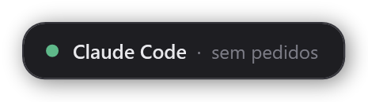
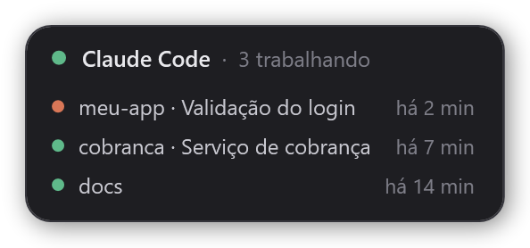
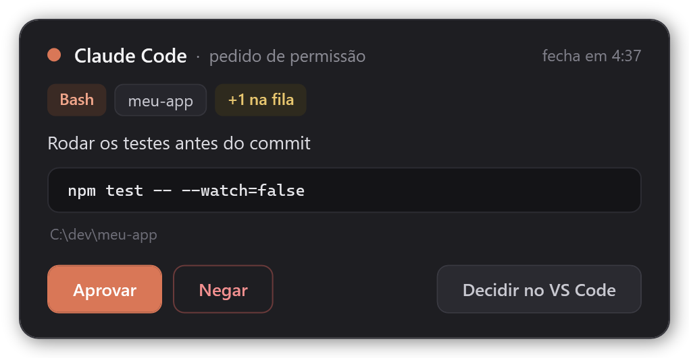
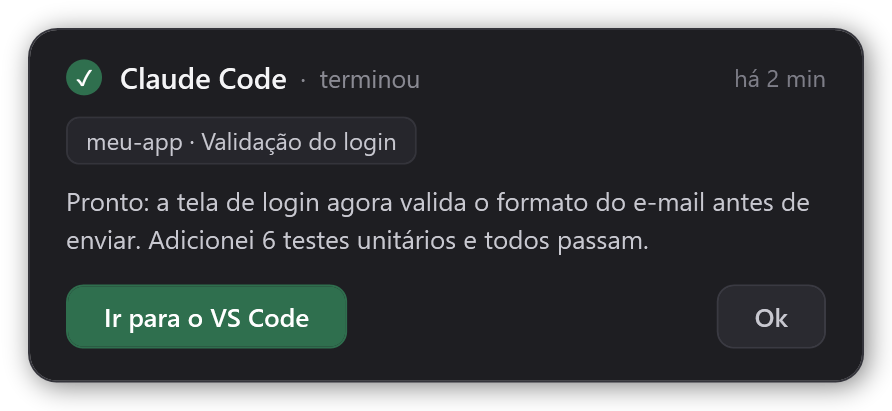
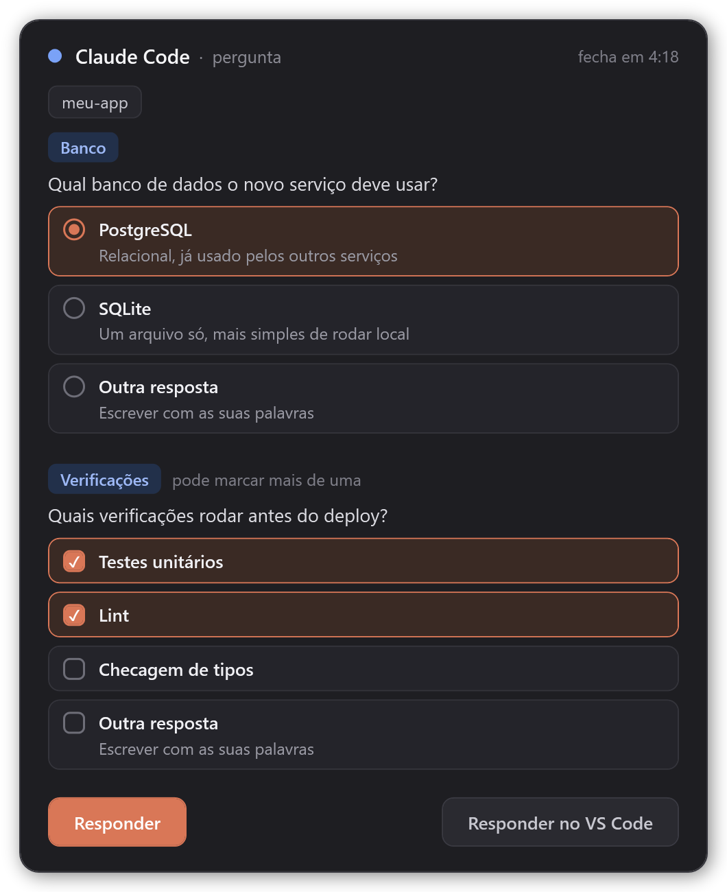

# Claude Code Widget

[English](README.md) · **Português**

Um widget para o [Claude Code](https://code.claude.com) no Windows que fica sempre por cima das outras janelas. Você continua trabalhando onde estiver. Quando o Claude precisa de você, aparece um cartão pequeno no canto da tela, sem tirar o foco da sua janela.

- **Pedidos de permissão**: mostra a ferramenta, o comando ou arquivo e o projeto, com os botões **Aprovar**, **Negar** e **Decidir no VS Code**.
- **Perguntas do Claude** (as de múltipla escolha): você marca uma ou várias opções, ou escreve a sua resposta.
- **Aviso de "terminou"**: quando o Claude termina uma resposta, o widget mostra o projeto e o começo da resposta, com um botão que leva de volta para a janela daquela sessão: VS Code ou terminal.

Quando não há nada para mostrar, ele vira uma pílula pequena, que dá para arrastar para qualquer canto:





<table>
  <tr>
    <td valign="top">
      <br>
      
    </td>
    <td valign="top">
      
    </td>
  </tr>
</table>

## Requisitos

- Windows 10 ou 11. O widget usa o Windows PowerShell 5.1 e o WPF, que já vêm no Windows. Não roda em macOS nem Linux.
- Claude Code, pela extensão do VS Code ou pelo terminal (Windows Terminal, PowerShell, cmd). Testado na versão 2.1.286. Responder perguntas pelo widget exige a versão 2.1.85 ou mais nova.
- O VS Code é opcional. Tudo funciona também com o Claude Code no terminal.

## Instalação

Num terminal:

```powershell
claude plugin marketplace add OPaiva-1721/claude-code-widget
claude plugin install opaiva-code-widget@claude-code-widget
```

Também dá para rodar os mesmos comandos dentro do Claude Code: `/plugin marketplace add OPaiva-1721/claude-code-widget` e depois `/plugin install opaiva-code-widget@claude-code-widget`.

Depois, abra uma sessão nova do Claude Code ou rode `/reload-plugins`. O widget abre sozinho junto com a primeira sessão.

### Atualizar

Vindo da versão 1.1.1 ou anterior? Siga [Renomeado na 2.0.0](#renomeado-na-200) em vez disto.

```powershell
claude plugin marketplace update claude-code-widget
claude plugin update opaiva-code-widget@claude-code-widget
```

Depois, abra uma sessão nova do Claude Code. O widget reinicia sozinho com a versão nova. O que mudou em cada versão está no [changelog](CHANGELOG.md), em inglês.

### Renomeado na 2.0.0

Até a versão 1.1.1 o plugin se chamava `claude-code-widget`. O Claude Code agora reserva os nomes de plugin que começam com `claude-` para os plugins da própria Anthropic, então a partir da 2.0.0 ele se chama `opaiva-code-widget`. O marketplace continua com o mesmo nome e avisa o Claude Code sobre o nome novo: depois que o marketplace é atualizado, o plugin antigo deixa de carregar e o Claude Code passa as suas configurações para o nome novo. Faça a troca uma vez à mão, para o plugin novo ficar instalado e o widget antigo sumir:

1. **Desinstale o plugin antigo primeiro.** Com os dois instalados, cada pedido aparece em dois widgets. Se ele disser que o plugin não está instalado, o Claude Code já fez a troca: é só continuar.

   ```powershell
   claude plugin uninstall claude-code-widget@claude-code-widget
   ```

2. Rode `/reload-plugins` em todas as sessões do Claude Code que ainda estão abertas, ou feche essas sessões. Sessões abertas continuam com os hooks antigos e abririam o widget antigo de novo. Depois feche o widget antigo: **botão direito → Fechar widget**.
3. Instale o novo:

   ```powershell
   claude plugin marketplace update claude-code-widget
   claude plugin install opaiva-code-widget@claude-code-widget
   ```

4. Abra uma sessão nova do Claude Code ou rode `/reload-plugins`.

O widget volta a abrir no canto padrão, porque o nome novo vem com uma pasta de dados nova.

## Como usar

| O que aparece | O que fazer |
| --- | --- |
| Ponto laranja piscando, **pedido de permissão** | **Aprovar** executa a ação. **Negar** bloqueia e avisa o Claude que você negou. **Decidir no VS Code** mostra o pedido normal no VS Code. |
| Ponto azul piscando, **pergunta** | Marque uma opção (ou várias, quando a pergunta permite) e clique em **Responder**. **Outra resposta** deixa você digitar; o Enter também envia. **Responder no VS Code** devolve a pergunta para o VS Code. |
| ✓ verde, **terminou** | **Ir para o VS Code** ou **Ir para o terminal** traz para a frente a janela daquela sessão. **Ok** fecha o aviso. |
| Pílula parada, **N trabalhando** | Clique para listar as sessões que estão trabalhando (projeto, título, tempo). Clique de novo para fechar a lista. |

- **Arraste** o widget para onde quiser. Ele lembra a posição.
- **Duplo clique** no widget (fora dos botões) traz a janela da sessão: no aviso de "terminou", a daquela sessão; nos outros casos, a da última sessão em que você digitou.
- **Botão direito → Fechar widget** fecha o widget. Os pedidos pendentes voltam para o VS Code. Ele abre de novo na próxima sessão ou no próximo pedido.
- **Ícone na bandeja.** O clique esquerdo liga e desliga o **não perturbe**; o botão direito abre o menu. No modo, pedidos e perguntas vão direto para o VS Code, o widget fica escondido e os avisos de "terminou" esperam até você desligar. Fica ligado até você desligar, inclusive depois de reiniciar. O Windows pode esconder ícones novos na bandeja: arraste-o para a barra uma vez.
- Com vários pedidos ou sessões, aparece quantos estão esperando (`+1 na fila`), e eles vêm um de cada vez.
- O chip do projeto também mostra o título da sessão (o nome dado com `/rename`, ou o automático do Claude Code). Quando várias sessões estavam trabalhando e a última termina, o aviso toca um som diferente.

## Comportamentos importantes

- **Nunca tira o foco.** Você continua digitando onde estava, mesmo quando clica nos botões. A única exceção é a **Outra resposta**: o widget pega o foco para você digitar e depois devolve.
- **Limite de 5 minutos.** Se ninguém responder, o cartão fecha e o pedido vai para o VS Code normalmente.
- **Longe do computador.** Sem uso de mouse nem teclado por 2 minutos, pedidos e perguntas não passam pelo widget e vão direto para o VS Code. Isso vale também para um cartão que já estava na tela. Se você usa o [Remote Control](https://code.claude.com/docs/en/remote-control), é assim que eles chegam no celular ou no navegador sem atraso.
- **Troca de monitor.** Se o monitor do widget some (por exemplo, quando você tira o notebook da dock), o widget vai para o canto inferior direito da tela principal em até 2 segundos. Quando o monitor volta, ele volta para onde você tinha colocado.
- **Sem aviso de "terminou" enquanto você está olhando.** Quando você manda uma mensagem, o widget guarda a janela onde você digitou: VS Code ou terminal. Se essa janela estiver na frente quando o Claude terminar, o aviso não aparece. No Windows Terminal isso vale por janela, não por aba. O aviso também some quando você manda uma mensagem nova naquela sessão, e depois de 12 horas.
- **Aprovação de plano fica no VS Code.** Aprovar um plano (`ExitPlanMode`) nunca passa pelo widget.
- **O que ele não faz:** mandar prompts novos. O Claude Code não tem um jeito suportado de enviar mensagens para uma sessão aberta no VS Code. Para isso, use o Remote Control.

## Configuração

Defina estas variáveis de ambiente no bloco `env` do `~/.claude/settings.json`:

| Variável | Padrão | O que faz |
| --- | --- | --- |
| `CLAUDE_WIDGET_LANG` | idioma do Windows | `pt` ou `en`. Qualquer outro valor usa inglês. |
| `CLAUDE_WIDGET_AWAY_SECS` | `120` | Segundos sem uso de mouse nem teclado até os pedidos deixarem de passar pelo widget. |

```json
{
  "env": {
    "CLAUDE_WIDGET_LANG": "pt"
  }
}
```

## Como funciona

```
Claude Code ──hook──▶ hook.ps1 ──queue\req-<id>.json──▶ widget.ps1 (WPF, sempre por cima)
            ◀─JSON──           ◀──queue\res-<id>.json──
```

- O `hook.ps1` roda em cinco eventos de hook. No `PermissionRequest` e no `PreToolUse` do `AskUserQuestion`, ele grava um arquivo de pedido e espera a resposta do widget. Depois devolve a decisão no formato de hook do Claude Code. No `Stop` ele grava o aviso de "terminou", e no `UserPromptSubmit` apaga esse aviso. No `UserPromptSubmit` ele também guarda a janela que está na frente, mas só se a árvore de processos mostrar que ela é daquela sessão do Claude Code. Um prompt enviado pelo celular deixa outra janela qualquer na frente, então ele é ignorado. No `SessionStart` ele só garante que o widget está aberto. Ele também acompanha quais sessões estão trabalhando (`busy\`), para saber quando a última de várias termina.
- O `widget.ps1` é um único processo que fica rodando, um por usuário. Ele é aberto fora da árvore de processos do Claude Code, então continua aberto quando a sessão acaba. Ele verifica a pasta da fila e mostra primeiro o item mais antigo.
- O `common.ps1` reúne o que os dois scripts compartilham: o nome do mutex do widget, a gravação atômica de JSON, o idioma da interface e a leitura da fila.
- Os arquivos ficam na pasta de dados do plugin, `%USERPROFILE%\.claude\plugins\data\opaiva-code-widget-claude-code-widget\`: a fila, a janela de cada sessão (`sessions\`), as sessões trabalhando agora (`busy\`, `busy-round.json`), o modo "não perturbe" (`dnd.flag`), a posição do widget (`state.json`) e os logs (`hook.log`, `widget.log`; cada um guarda até 256 KB, mais um arquivo `.old`).

## Segurança

- Aprovar no widget é o mesmo que clicar em **Allow** no VS Code. O widget mostra o comando ou o caminho do arquivo inteiro antes de você decidir.
- Tudo fica na sua máquina. O widget não acessa a rede e não coleta nenhum dado. Os únicos dados são os arquivos na pasta de dados do plugin, dentro do seu perfil de usuário.
- Pedidos e respostas são arquivos comuns que só o seu usuário do Windows pode gravar. Um programa rodando como você conseguiria gravar uma resposta, mas um programa assim já conseguiria fazer qualquer coisa que você faz.
- Aprovação de plano e tudo o que você não responder sempre voltam para a confirmação normal do Claude Code.

## Problemas comuns

- **O widget não aparece.** Abra uma sessão nova, ou rode `/reload-plugins`, e confira `claude plugin list`. Depois veja o `widget.log` na pasta de dados.
- **Os pedidos continuam aparecendo só no VS Code.** Confira o `hook.log`. Cada evento grava uma linha lá, como `PermissionRequest 1a2b3c4d Bash -> allow`. Se não aparecer nada novo, os hooks não foram carregados.
- **Texto com `?` ou acentos quebrados.** Verifique se os arquivos `.ps1` não foram salvos de novo com outra codificação. Eles precisam ficar só com caracteres ASCII; os textos da interface ficam no `strings.json` (UTF-8).

## Desinstalar

```powershell
claude plugin uninstall opaiva-code-widget@claude-code-widget
```

O widget aberto não fica sabendo que o plugin foi removido. Feche com **botão direito → Fechar widget**, ou saia da sua conta do Windows.

## Desenvolvimento

- Validar o plugin e o marketplace: `claude plugin validate .` e `claude plugin validate plugins/opaiva-code-widget`.
- Rodar os testes: instale o [Pester](https://pester.dev) 5.5 ou mais novo uma vez com `Install-Module Pester -MinimumVersion 5.5 -Scope CurrentUser -Force -SkipPublisherCheck` e depois rode `powershell -NoProfile -File tools\test.ps1`. Um dos testes mostra um widget no canto da tela por alguns segundos; use `-ExcludeTag Desktop` para pular os testes que abrem o widget de verdade. O GitHub Actions roda a mesma suíte a cada push e pull request.
- Gerar de novo as imagens do README a partir do código real do widget: `powershell -NoProfile -File tools\render-screenshots.ps1`. Os dados de exemplo ficam em `tools/samples.json`.
- Aumente o `version` em `plugins/opaiva-code-widget/.claude-plugin/plugin.json` a cada versão nova. Quem já instalou fica na versão antiga até o número mudar.

## Licença

[MIT](LICENSE)
